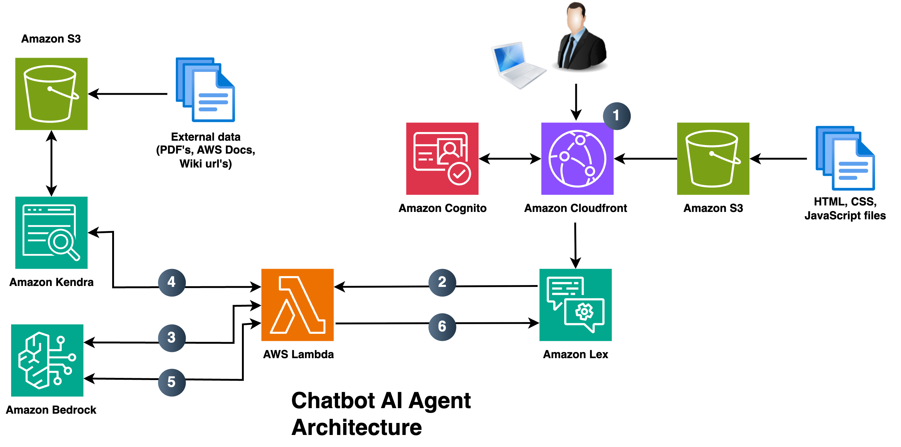
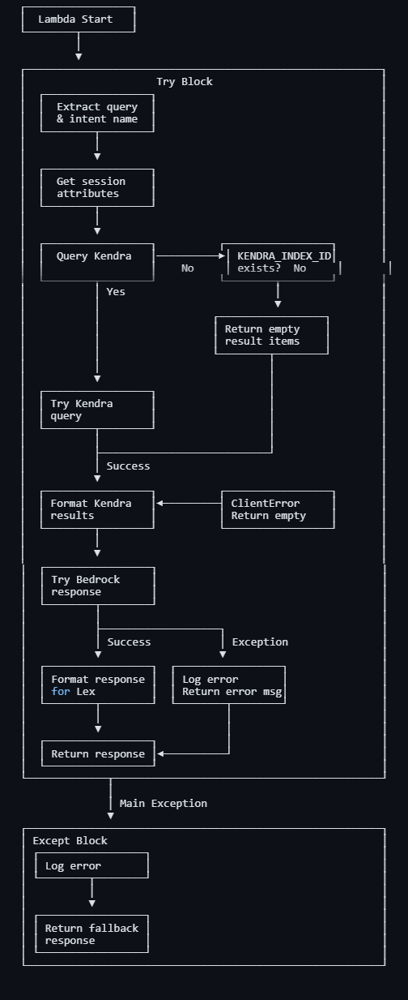
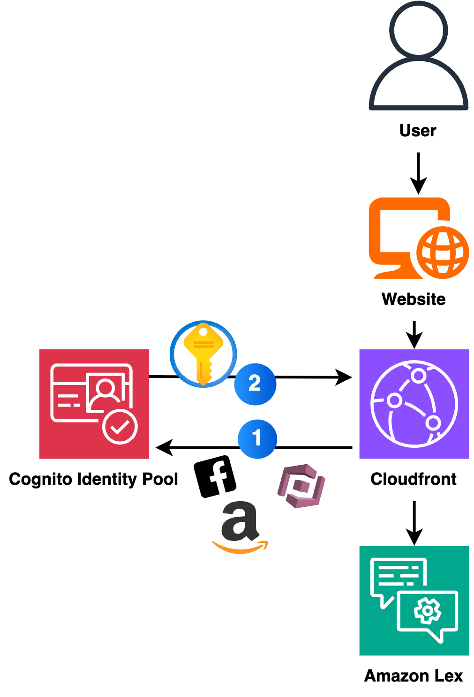

<h1>Chatbot AI Agent Using AWS</h1>
<h2>Problem or Challenge</h2>

Applications/services must be protected in case of a disaster or emergency. to design the architecture of this applications employees often need access to critical information related to disaster recovery, business continuity, and safety recommendations. However, this information is currently scattered across various resources, wikis, and documentation. Employees often struggle to find the right information when they need it the most.

<h2>Proposed Solution</h2>
<h3>Final Architecture</h3>

<ol>
  <li><strong>Initial User Interaction:</strong></li>
  <ul>
    <li>User accesses website through CloudFront</li>
    <li>CloudFront serves static website from S3 (HTML, CSS, JS files)</li>
    <li>Cognito handles user authentication/permissions and provide necessary AWS credentials</li>
    <li>Frontend sends query to Lex through authenticated connection</li>
  </ul>
  <li><strong>Lex Intent Check:</strong></li>
  <ul>
    <li>Lex analyzes query to identify intent</li>
    <li>Determines what kind of information user is seeking</li>
    <li>If Lex has matching intent → provides direct response</li>
    <li>If no matching intent → forwards to Lambda function</li>
  </ul>
  <li><strong>Lambda Initial Processing:</strong></li>
  <ul>
    <li>ConversationalRetrievalChain used</li>
    <li>Calls Bedrock (first LLM) to formulate search prompt</li>
    <li>Uses conversation history</li>
  </ul>
  <li><strong>Kendra Search:</strong></li>
  <ul>
    <li>Lambda sends prompt to Kendra retrieve API</li>
    <li>Kendra searches through documents in S3</li>
    <li>Kendra returns relevant context passages</li>
  </ul>
  <li><strong>Response Generation:</strong></li>
  <ul>
    <li>Lambda sends prompt + Kendra context to Bedrock (second LLM)</li>
    <li>Bedrock uses search results to generate natural response</li>
    <li>Different LLM used for response generation</li>
    <li>Optimized for cost/performance</li>
  </ul>
  <li><strong>Response Delivery</strong></li>
  <ul>
    <li>Lambda sends response back to Lex</li>
    <li>Lex stores conversation history in session</li>
    <li>Response displayed to user through frontend</li>
  </ul>
</ol>

<h2>AWS Lambda</h2>
<h3>Flow diagram of lambda code</h3>

<h3>Lambda code</h3>

<h3>User access</h3>

Amazon Cognito serves as the authentication and authorization backbone for web applications distributed through CloudFront. In our implementation, we're utilizing Cognito's Identity Pools to manage unauthenticated (guest) access, which provides temporary AWS credentials to users accessing the chatbot interface through CloudFront's secure content delivery network.

The security flow begins when a user accesses the website through CloudFront, which serves the static content securely via HTTPS. Behind the scenes, Cognito's Identity Pool issues temporary AWS credentials, allowing the frontend application to interact with AWS services (specifically Lex in our case) through IAM roles that define precise permissions for unauthenticated users.

This architecture ensures secure and scalable access management while maintaining simplicity for public chatbot access. The combination of CloudFront's secure content delivery and Cognito's identity management creates a robust system where users can interact with AWS services safely, without requiring authentication, while still maintaining control over resource access through IAM policies.

